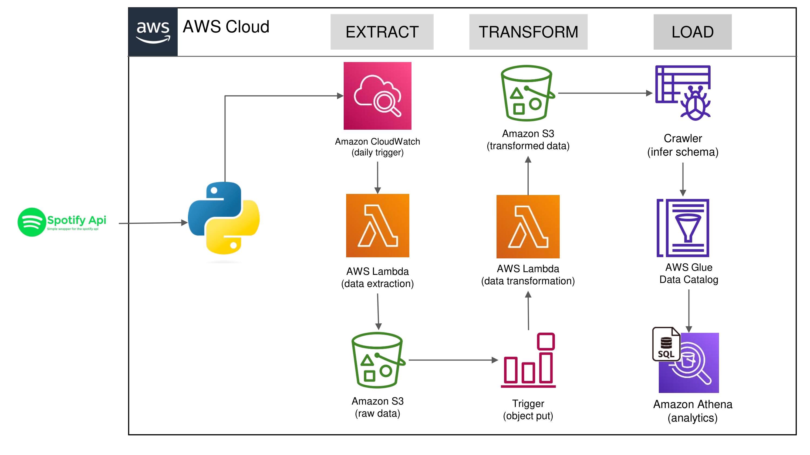

# Spotify ETL Project

This project automates the extraction, transformation, and loading (ETL) of Spotify playlist data using Python, Spotify, AWS Lambda, and Amazon S3. The pipeline enables scalable, serverless data engineering and analytics on Spotify music data.

---

## Architecture



**Pipeline Overview:**
- **Extract:**  
  - AWS Lambda (Python) fetches playlist data from the Spotify API (triggered by CloudWatch).
  - Raw data is stored in Amazon S3.
- **Transform:**  
  - S3 event triggers a second Lambda function to process and normalize the data into CSVs (songs, albums, artists).
  - Transformed data is stored in a separate S3 location.
- **Load:**  
  - AWS Glue Crawler infers schema and updates the Glue Data Catalog.
  - Amazon Athena enables SQL-based analytics on the processed data.

---

## AWS Services Creation

This project leverages several AWS services to build a scalable, serverless ETL pipeline:

- **Amazon S3:**  
  - Create S3 buckets for storing raw and transformed Spotify data.
  - Example paths: `raw_data/to_processed/` and `transformed_data/`.

- **AWS Lambda:**  
  - Create two Lambda functions:
    - **Data Extraction Lambda:** Fetches data from the Spotify API and writes raw JSON to S3.
    - **Data Transformation Lambda:** Triggered by S3 object creation, processes raw data, and writes CSVs to S3.
  - Assign IAM roles with permissions for S3 access and CloudWatch logging.

- **Amazon CloudWatch:**  
  - Set up a CloudWatch Event Rule (EventBridge) to trigger the extraction Lambda on a schedule (e.g., daily).

- **AWS Glue:**  
  - Create a Glue Crawler to scan the transformed data in S3 and infer the schema.
  - The crawler updates the AWS Glue Data Catalog for easy querying.

- **Amazon Athena:**  
  - Use Athena to run SQL queries on the transformed data cataloged by Glue.

---

## S3 Bucket Structure

All data for this project is stored in a single S3 bucket:  
**Bucket name:** `spotify-etl-prj-py`

The bucket contains the following folders:

- **raw_data/**
  - **to_processed/**  
    Stores raw data files after ingestion, ready to be transformed.
  - **processed/**  
    Stores raw data files after transformation is complete.

- **transformed_data/**
  - **album_data/**  
    Contains CSV files with album information.
  - **artist_data/**  
    Contains CSV files with artist information.
  - **songs_data/**  
    Contains CSV files with song information.

This structure helps organize the ETL workflow and makes it easy to manage and locate files at each stage of the pipeline.

## Project Structure

- [`ingestion.py`](ingestion.py): Extracts playlist data from Spotify and uploads raw JSON to S3.
- [`transformation.py`](transformation.py): Transforms raw data into structured CSVs and uploads them to S3.

---

## Prerequisites

- Python 3.x
- AWS account with S3, Lambda, Glue, and Athena permissions
- Spotify API credentials (`client_id`, `client_secret`)
- Python packages: `spotipy`, `boto3`, `pandas`

---

## About the Required Python Packages

This project relies on the following key Python packages:

- **spotipy:**  
  Spotipy is a lightweight Python library for the Spotify Web API. It is used in this project to authenticate with Spotify and extract playlist, track, album, and artist data programmatically.

- **pandas:**  
  Pandas is a powerful data analysis and manipulation library for Python. In this project, it is used to transform raw Spotify data into structured tabular formats (CSV files) for further analysis and storage.

Both packages must be available to your AWS Lambda functions. If deploying on AWS Lambda, ensure these dependencies are included in a Lambda Layer and attached to your function, as described in the [Lambda Layers for External Python Modules](#lambda-layers-for-external-python-modules) section.

## Using Lambda Layers for External Python Packages

To provide your AWS Lambda function with external Python packages (such as `spotipy` and `pandas`):

1. Download or create a ZIP file containing the required packages (e.g., `spotipy`) from the `packages` directory. For `pandas`, you can use AWS's provided public layer or include it in your ZIP.
2. Go to the AWS Lambda Console → Layers.
3. Click "Create layer" and upload your ZIP file.
4. Attach the created layer to your Lambda function.

That’s it! Your Lambda function will now have access to the required packages.

## Setup

1. **Install dependencies:**
   ```sh
   pip install spotipy boto3 pandas
   ```

2. **Set environment variables:**
   - `client_id` and `client_secret` for Spotify API.

3. **Configure AWS credentials:**
   - Use AWS CLI (`aws configure`) or environment variables.

---

## Usage

### 1. Ingest Spotify Data

Run the ingestion script to fetch playlist tracks and upload raw JSON to S3:

```sh
python ingestion.py
```

### 2. Transform Data

Run the transformation script to process raw data and upload transformed CSVs to S3:

```sh
python transformation.py
```

---

## AWS Lambda Deployment

- Both scripts can be deployed as AWS Lambda functions.
- Set environment variables and IAM permissions for S3 and Spotify API access.
- Use CloudWatch Events to schedule extraction and S3 triggers for transformation.

---

## Output

- **Raw Data:**  
  - S3: `raw_data/to_processed/`
- **Transformed Data:**  
  - S3: `transformed_data/songs_data/`
  - S3: `transformed_data/album_data/`
  - S3: `transformed_data/artist_data/`

---
